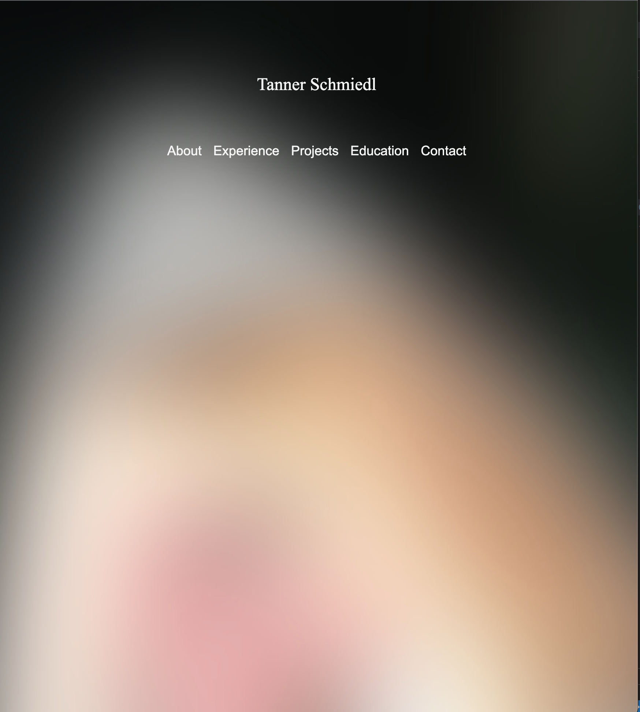
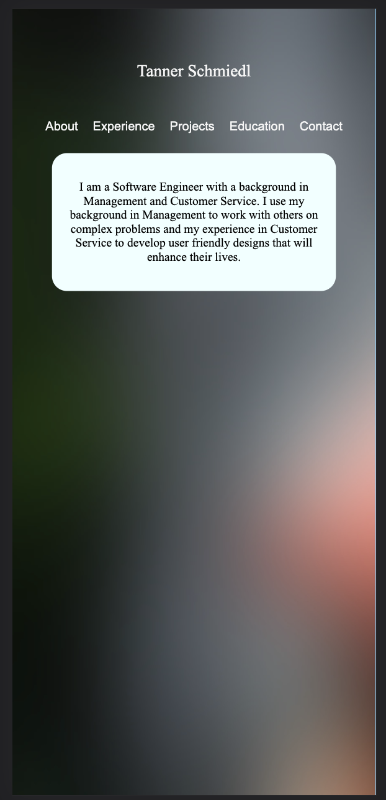
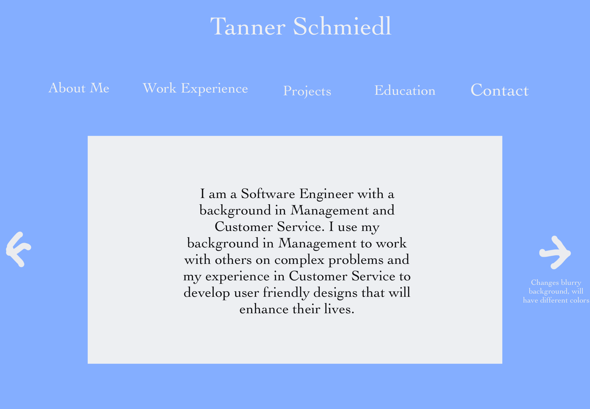
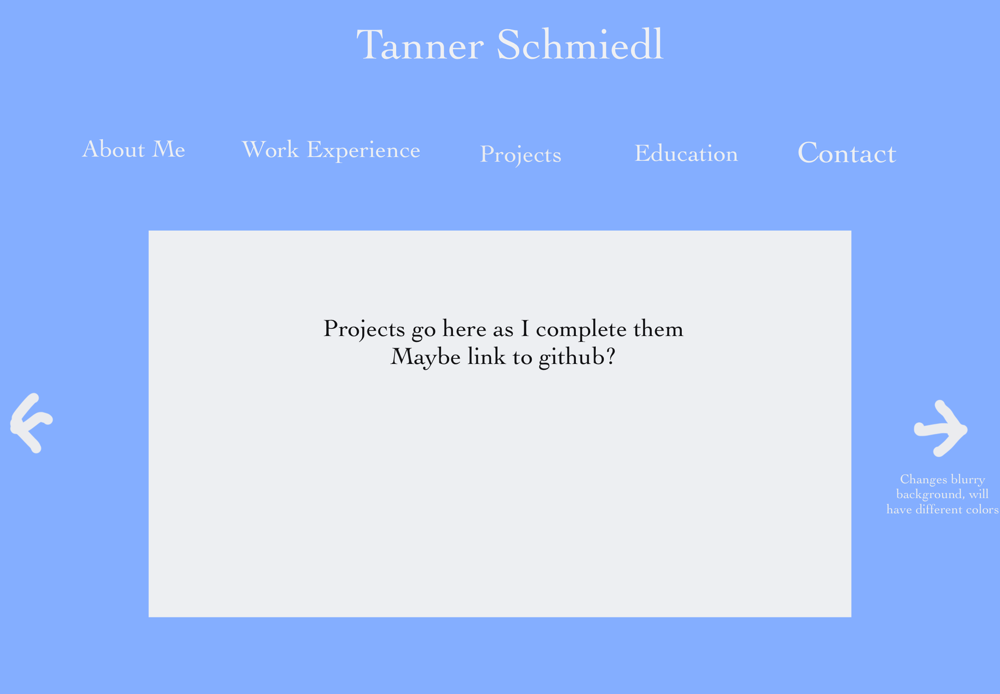
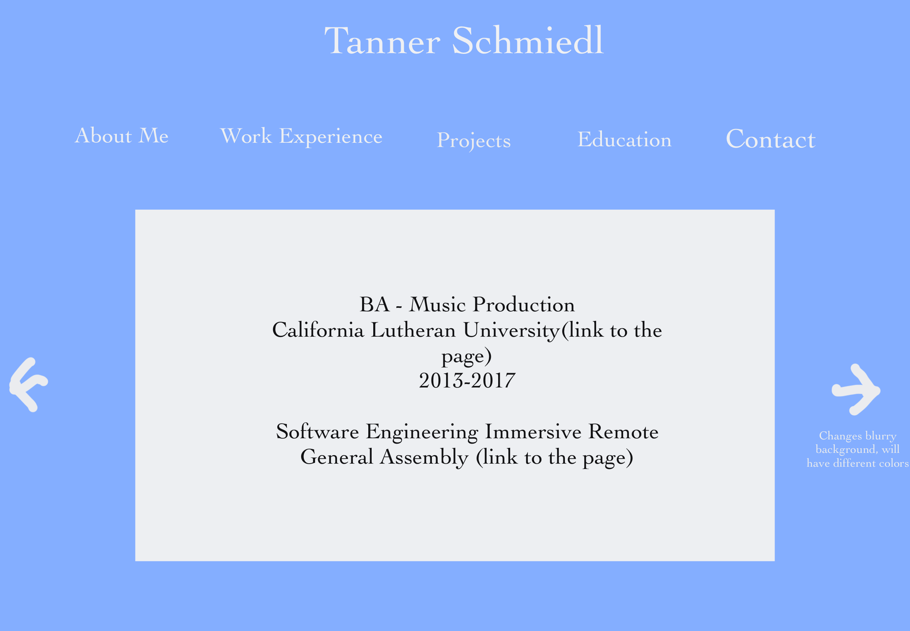
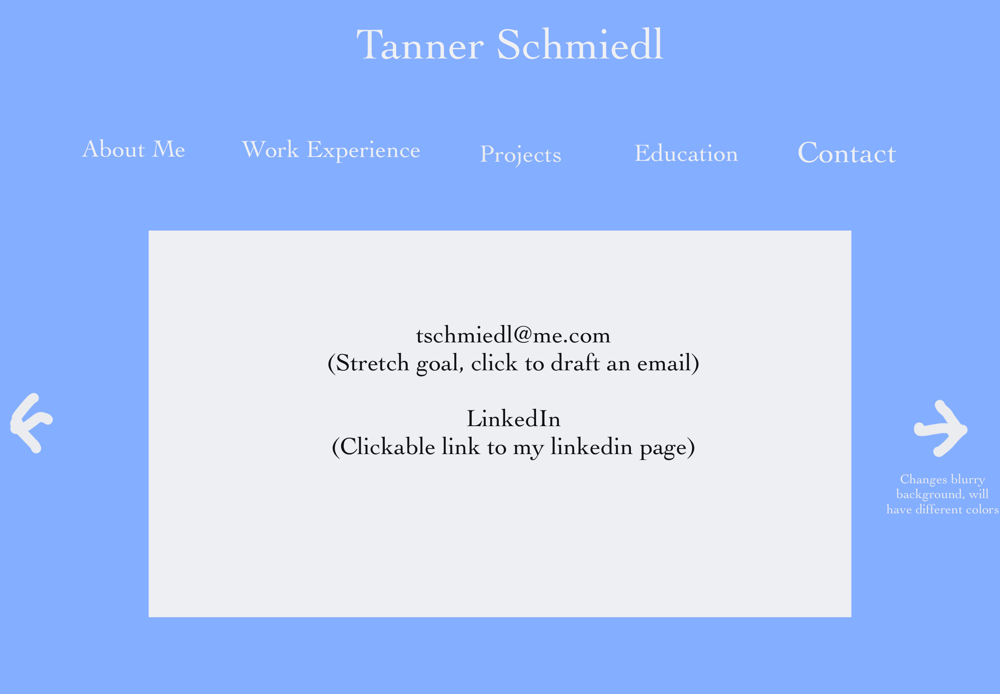

# portfolio
Public portfolio page for Tanner Schmiedl

Screenshot of Desktop View

Screenshot of Mobile View

List of technologies used:
HTML 5
CSS
Javascript
JQuery
JQuery-Backstretch

Installation instructions:
Be connected to internet

User Stories:
As a hiring manager, I want to clearly see past working experience so that I can see the work that Tanner has done in the past.

As a hiring manager, I want to clearly see the education Tanner has gone through so that I can validate where he learned the skills he mentions.

As a user of the website, I want to learn something about Tanner I did not know before so that I can leave the website with more knowledge than before.

As a user of the website, I want a pleasant experience learning about Tanner through a functional website and user-friendly design so that I can get a feel for how he likes to design websites.

Wireframes:

Major hurdles:

A major goal of mine was to have the background change. I was going to assign it to a button but was not able to change the background image property since I implemented it with CSS but found a solution on google using JQuery-Backstretch. 

Another hurdle was using flexbox, I had to research how to implement flexbox accurately. 

I also had trouble thinking of ways to implement Javascript but ended up manipulating the DOM to create links to email me as well as view my resume on a separate page. 